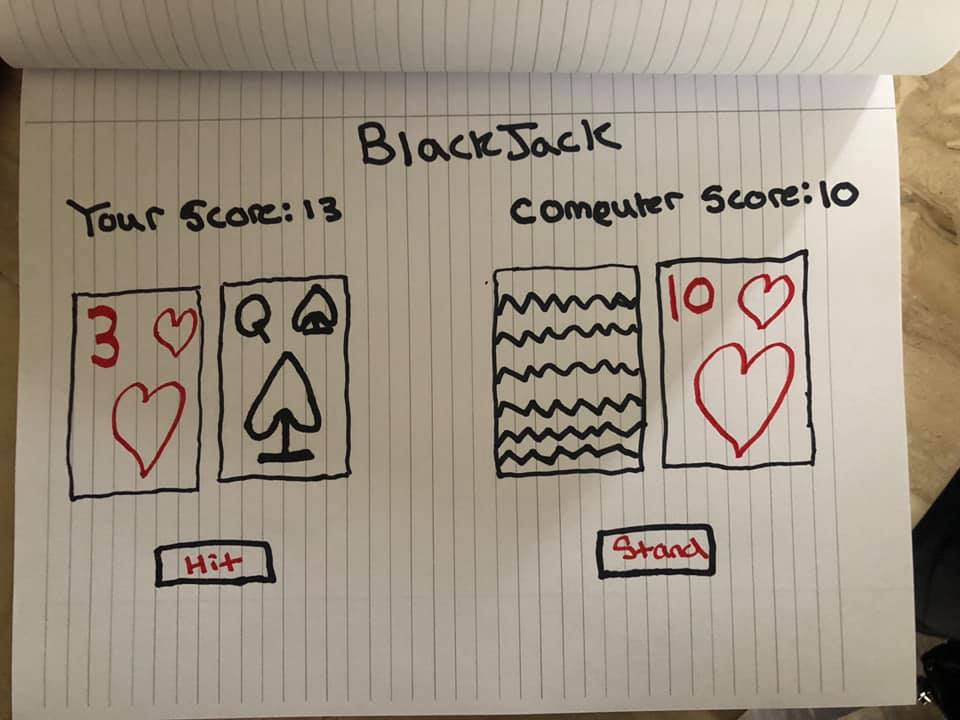

# BlackJack


```1. Initialize state variables
  1.1 Make empty arrays for My cards and dealer cards
  1.2 "gameState" starts out as MY_TURN
  1.3 Initital deckOfCards to be randomly shuffled into an array of 52 card objects
2. Initial deal
 2.1 push two cards into myCards array from calling the dealCard function
 2.2 push two cards into the dealerCards array from the dealCard function
3. Render initial state
 3.1 render a playing card for each of myCards
 3.2 render a playing a card for each of dealerCards. 
  3.2.1 render the first dealerCard face down because gameState is currently MY_TURN
 3.3 render a hit button
 3.4 render a stand button
 3.5 show my score and dealer score by summing the values in myCards array and dealerCards array
4. If user hits:
 4.1 push one card into myCards array from calling the dealCard function
 4.2 if the score is under 21 then gameState remains in MY_TURN
 4.3 if the score is over 21:
  4.3.1 gameState becomes DEALER_WON
  4.3.2 render the Dealer has won
5. If user stands:
 5.1 gameState turns from MY_TURN to DEALER_TURN
 5.2 Re render and show the dealers card flipped over
 5.3 If Dealers card sum is greater than myCard sum:
  5.3.1 gameState becomes DEALER_WON 
  5.3.2 render the Dealer has won
 5.4 Otherwise dealer hits:
  5.4.1 push one card into dealerCards array from calling the dealCard function
  5.4.2 if the score is under 21 then gameState remains DEALER_TURN, loop back to 5.3
  5.4.3 if the score is over 21 then dealer busts:
   5.4.3.1 gameState changes from DEALER_TURN to I_WON
   5.4.3.2 render I won
